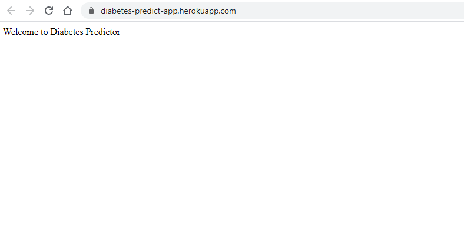
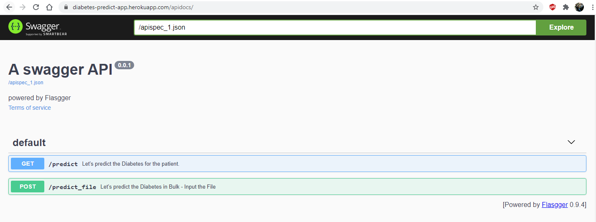
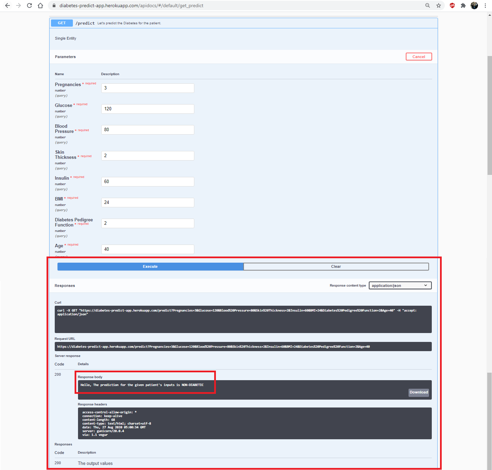
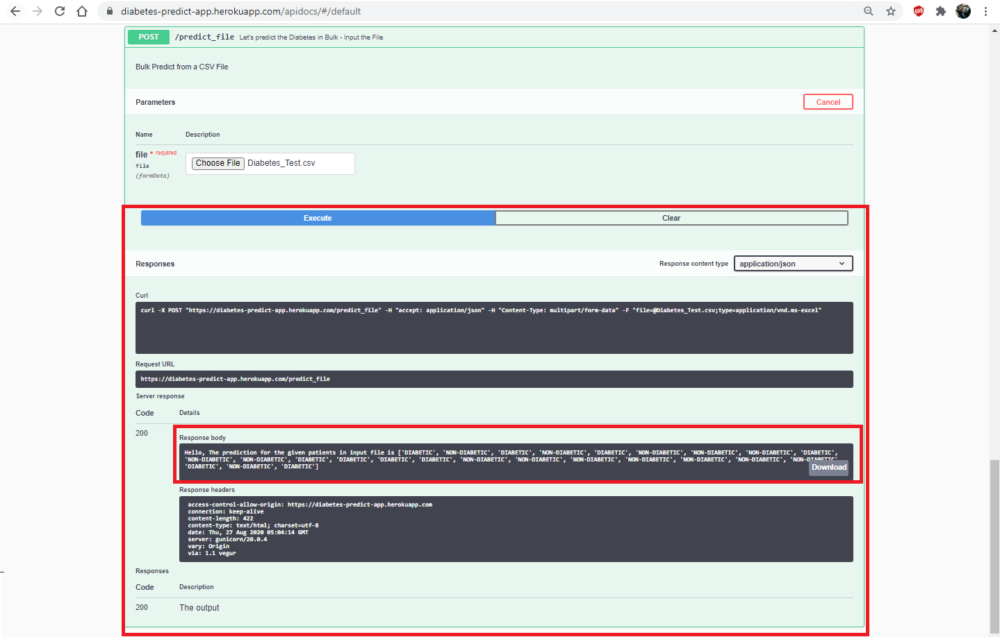

# Diabetes Predictor using Logistic Regression
This is small demo on diabetes prediction using is a logistic regression and frontend via swagger.

The input features:     Pregnancies, Glucose, BloodPressure, SkinThickness, Insulin, BMI, DiabetesPedigreeFunction,Age.

https://diabetes-predict-app.herokuapp.com/

https://diabetes-predict-app.herokuapp.com/apidocs/

